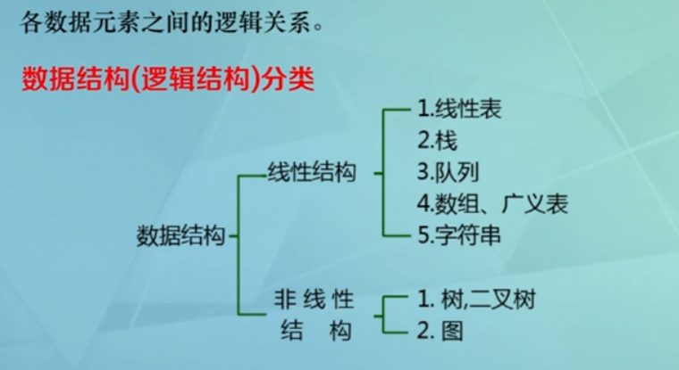
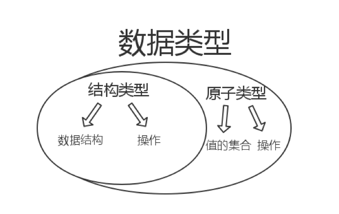

---
title:数据结构基础
---
# 数据结构基础

## 写在前面
我们所需要的如栈、队列、链表、散列表等结构，以及查找、排序等算法，在编程语言的开发工具包中都有完美的实现，我只需要掌握如何使用它们就可以了，为什么还要去弄懂这里面的算法原理呢?

---
## 基本概念

**数据结构 + 算法 = 程序设计**  
* 数据:所有能输入到计算机中并被计算机程序加工、处理的符号的总称。如:整数、实数、字符、声音、图象、图形等。
* 数据元素:数据的基本单位。(元素、记录、结点、顶点)
* 数据项:是数据的不可分割的最小单位。如:姓名、年龄等一个数据元素可由一个或多个数据项组成。构成数据元素的数据称作该数据元素的数据项
* 数据对象:由性质相同(类型相同)的数据元素组成的**集合**。数据对象是数据的一个子集。
* 数据结构：数据结构是指相互之间存在一定联系（关系）的数据元素的集合。元素之间的相互联系（关系）称为逻辑结构。

  
一行为数据元素（一个记录），一列为数据项，两行就是数据对象，两行之间的联系就是数据结构，数据是个非常大的概念什么都可以是数据

---
* 数据结构分为逻辑结构，存储结构
* 逻辑结构：数据结构是指相互之间存在一定联系（关系）的数据元素的集合。元素之间的相互联系（关系）称为逻辑结构。
* 存储结构:数据结构在计算机中的实际表达方式，它包括对数据元素的表示和对关系的表示。存储结构主要有：顺序存储、链式存储、索引存储和散列存储。
---
* 一种数据结构＋定义在此种数据结构上的一组操作＝结构类型
* 一种值的集合＋定义在此种值的集合上的一组操作＝原子类型
* 结构类型＋原子类型＝数据类型
* 数据结构是一种值的集合，这种值集＋值集上的操作就是结构类型，而结构类型是数据类型中的一种

--- 
* 数据类型：是一个值的集合和定义在这个值集上的一组操作的总称。
* 抽象数据类型：是指一个数学模型以及定义在该模型上的一组操作。
* 数据类型和抽象数据类型的相同点在于它们具有相同的逻辑特性，不同点在于数据类型即关系数据集的逻辑特性又关系其物理特性，而抽象数据类型只关心数据集的抽象特性

---
* 数据结构：是相互之间存在一种或多种特定关系的数据元素的集合，包括逻辑结构和物理结构。
* 数据类型：是一个值的集合和定义在这个值集上的一组操作的总称。
* 抽象数据类型：是指一个数学模型以及定义在该模型上的一组操作。
* 抽象数据类型可以由三元组（DSP）表示  
D表示数据对象  
S是D中数据元素之间的关系集  
P是对D中数据元素的基本操作。  

## 总结

数据类型一分为二使两边的人都可以更集中注意力于自己的工作范围，进行更深的钻研。使用抽象数据类型是指仅仅关注数据类型的逻辑特性，而不关注硬件实现。实现基本数据类型是指在物理层面实现数据类型的逻辑特性；

---

## 算法
* 所谓算法是对特定问题求解步骤的一种描述，换言之，算法给出了求解一个问题的大致思路和步骤，但它还不是程序。
* 描述算法的方法 
1.自然语言;
2.程序设计语言;
3.流程图(框图) ;
4.伪码语言;
5.类c语言（c语言和伪代码结合）
* 伪代码是一种包括高级程序设计语言的三种基本结构(顺序、选择、循环)和自然语言成分的“面向读者”的语言。

---
只谈数据结构，当然是可以，我们可以在很短的时间就把几种重要的数据结构介绍完。听完后，很可能你没什么感觉，不知道这些数据结构有何用处。但如果我们再把相应的算法也拿来讲一讲，你就会发现哦，计算机界的前辈们，的确是一些很牛很牛的人，他们使程序那么漂亮

